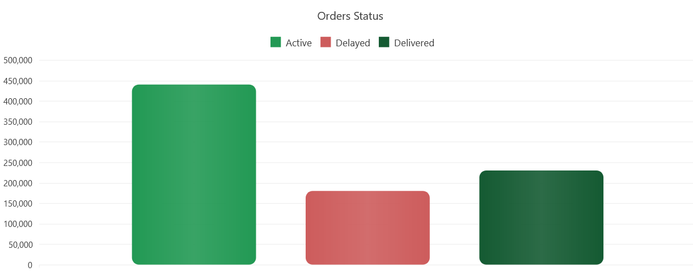
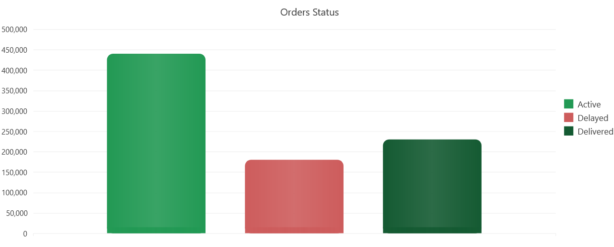

## Environment

<table>
 <tr>
  <td>Product</td>
  <td>{{ site.product }} Chart</td>
 </tr>
</table>

## Description

How can I change {{ site.product }} Chart columns to appear with rounded corners?

## Solution

You can achieve this requirement using the .Visual() capability offered by the component. Check the full implementation in this live REPL sample:

[Chart Example: All Corners Rounded](https://netcorerepl.telerik.com/myPlcPlg30MY8AnT10)

The result looks like this:



```Razor
<div class="demo-section wide">
    @(Html.Kendo().Chart<Kendo.Mvc.Examples.Models.ElectricityProduction>()
        .Name("chart")
        .Title("Orders Status")
        .Legend(legend => legend
            .Position(ChartLegendPosition.Top)
        )
        .SeriesDefaults(seriesDefaults => seriesDefaults
            .Column().Visual("columnVisual")
            .Highlight(highlight => highlight.Toggle("toggleHandler"))
        )
        .Series(series => {
            series.Column(new double[] { 440000 })
            .Name("Active").Color("#229954"); 
            series.Column(new double[] { 180000 })
            .Name("Delayed").Color("#CD5C5C");
            series.Column(new double[] { 230000 })
            .Name("Delivered").Color("#145a32");
        })
        .CategoryAxis(axis => axis
            .Labels(labels => labels.Rotation(-90))
            .MajorGridLines(lines => lines.Visible(false))
        )
        .ValueAxis(axis => axis.Numeric()
            .Labels(labels => labels.Format("{0:N0}"))
            .MajorUnit(50000)
            .Line(line => line.Visible(false))
        )
        .Tooltip(tooltip => tooltip
            .Visible(true)
            .Format("{0:N0}")
        )
    ) 
</div>
<script>
    function columnVisual(e) {
        return createColumn(e.rect, e.options.color);
    }

    function toggleHandler(e) {
        e.preventDefault();
        var visual = e.visual;
        var opacity = e.show ? 0.8 : 1;

        visual.opacity(opacity);
    }

    function createLegendItem(e) {
        var drawing = kendo.drawing;
        var geometry = kendo.geometry;

        var color = e.options.markers.background;
        var labelColor = e.options.labels.color;
        var rect = new geometry.Rect([0, 0], [120, 50]);
        var layout = new drawing.Layout(rect, {
            spacing: 5,
            alignItems: "center"
        });

        var overlay = drawing.Path.fromRect(rect, {
            fill: {
                color: "#fff",
                opacity: 0
            },
            stroke: {
                color: "none"
            },
            cursor: "pointer"
        });

        var column = createColumn(new geometry.Rect([0, 0], [15, 10]), color);
        var label = new drawing.Text(e.series.name, [0, 0], {
            fill: {
                color: labelColor
            }
        })

        layout.append(column, label);
        layout.reflow();

        var group = new drawing.Group().append(layout, overlay);

        return group;
    }

    function createColumn(rect, color) {
        var drawing = kendo.drawing;
        var geometry = kendo.geometry;

        var gradient = new drawing.LinearGradient({
            stops: [{
                offset: 0,
                color: color
            }, {
                offset: 0.5,
                color: color,
                opacity: 0.9
            }, {
                offset: 0.5,
                color: color,
                opacity: 0.9
            }, {
                offset: 1,
                color: color
            }]
        });

        var cornerRadius = 10;
        var roundedRect = new geometry.Rect(rect.origin, rect.size, cornerRadius);
        var column = new drawing.Rect(roundedRect, {
            fill: gradient,
            stroke: {
                color: "none"
            }
        });

        return column;
    }
</script>
```

It is also possible to have only the top corners rounded:

[Chart Example: Top Corners Rounded](https://netcorerepl.telerik.com/woPPcpOm0806bKQP47)

Here is the result:



```Razor
<div class="demo-section wide">
    @(Html.Kendo().Chart<Kendo.Mvc.Examples.Models.ElectricityProduction>()
        .Name("chart")
        .Title("Orders Status")
        .SeriesDefaults(seriesDefaults => seriesDefaults
            .Column().Visual("columnVisual")
            .Highlight(highlight => highlight.Toggle("toggleHandler"))
        )
        .Series(series => {
            series.Column(new double[] { 440000 })
            .Name("Active").Color("#229954"); 
            series.Column(new double[] { 180000 })
            .Name("Delayed").Color("#CD5C5C");
            series.Column(new double[] { 230000 })
            .Name("Delivered").Color("#145a32");
        })
        .CategoryAxis(axis => axis
            .Labels(labels => labels.Rotation(-90))
            .MajorGridLines(lines => lines.Visible(false))
        )
        .ValueAxis(axis => axis.Numeric()
            .Labels(labels => labels.Format("{0:N0}"))
            .MajorUnit(50000)
            .Line(line => line.Visible(false))
        )
        .Tooltip(tooltip => tooltip
            .Visible(true)
            .Format("{0:N0}")
        )
    ) 
</div>
<script>
    function columnVisual(e) {
        return createColumn(e.rect, e.options.color);
    }

    function toggleHandler(e) {
        e.preventDefault();
        var visual = e.visual;
        var opacity = e.show ? 0.8 : 1;

        visual.opacity(opacity);
    }

    function createLegendItem(e) {
        var drawing = kendo.drawing;
        var geometry = kendo.geometry;

        var color = e.options.markers.background;
        var labelColor = e.options.labels.color;
        var rect = new geometry.Rect([0, 0], [120, 50]);
        var layout = new drawing.Layout(rect, {
            spacing: 5,
            alignItems: "center"
        });

        var overlay = drawing.Path.fromRect(rect, {
            fill: {
                color: "#fff",
                opacity: 0
            },
            stroke: {
                color: "none"
            },
            cursor: "pointer"
        });

        var column = createColumn(new geometry.Rect([0, 0], [15, 10]), color);
        var label = new drawing.Text(e.series.name, [0, 0], {
            fill: {
                color: labelColor
            }
        })

        layout.append(column, label);
        layout.reflow();

        var group = new drawing.Group().append(layout, overlay);

        return group;
    }

    function createColumn(rect, color) {
        var drawing = kendo.drawing;
        var geometry = kendo.geometry;

        var gradient = new drawing.LinearGradient({
            stops: [{
                offset: 0,
                color: color
            }, {
                offset: 0.5,
                color: color,
                opacity: 0.9
            }, {
                offset: 0.5,
                color: color,
                opacity: 0.9
            }, {
                offset: 1,
                color: color
            }]
        });

        var cornerRadius = 10;
        var roundedRect = new geometry.Rect(rect.origin, rect.size, cornerRadius);
        var column = new drawing.Rect(roundedRect, {
            fill: gradient,
            stroke: {
                color: "none"
            }
        });

        var baseOrigin = [rect.origin.x, rect.origin.y + rect.size.height - cornerRadius];
        var baseSize = [rect.size.width, cornerRadius];
        var baseRect = new geometry.Rect(baseOrigin, baseSize);
        var squareBase = new drawing.Rect(rect, {
            fill: gradient,
            stroke: {
                color: "none"
            },
            clip: drawing.Path.fromRect(baseRect)
        });

        var group = new drawing.Group();
        group.append(column, squareBase)
        return group;
    }
</script>
```

## See Also

* [Telerik UI for {{ site.framework }} Knowledge Base](https://docs.telerik.com/{{ site.platform }}/knowledge-base)
