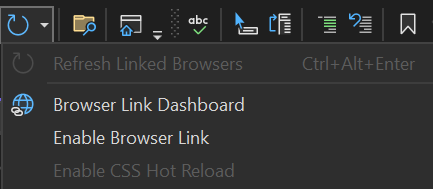

## Environment

<table>
  <tr>
  	<td>Product</td>
  	<td>Telerik® UI for ASP.NET Core</td>
  </tr>
</table>


## Description

New versions of Microsoft Visual Studio provide the [Hot Reload](https://learn.microsoft.com/en-us/aspnet/core/test/hot-reload?view=aspnetcore-9.0) and [Browser Link Refresh](https://learn.microsoft.com/en-us/aspnet/core/client-side/using-browserlink?view=aspnetcore-9.0) features in order to facilitiate working with ASP.NET Core projects.

This creates a communication channel between the development environment and one or more web browsers. And since this communication is done with a javascript file connection, when you implement the Content Security Policy meta tag for your application you can see these errors:

```js
browserLink:4 Refused to connect to 'http://localhost:.../8d05de7…/browserLinkSignalR/…owserLink.initializationData.browserId&browserId=...' because it violates the following Content Security Policy directive: "default-src 'self'". Note that 'connect-src' was not explicitly set, so 'default-src' is used as a fallback.
send	@	browserLink:4

browserLink:4 Refused to connect to 'http://localhost:.../8d05de7…/browserLinkSignalR/…owserLink.initializationData.browserId&browserId=...' because it violates the following Content Security Policy directive: "default-src 'self'". Note that 'connect-src' was not explicitly set, so 'default-src' is used as a fallback.
send	@	browserLink:4
 
aspnetcore-browser-refresh.js:329 Refused to connect to 'wss://localhost:.../TelerikProjectName/' because it violates the following Content Security Policy directive: "default-src 'self'". Note that 'connect-src' was not explicitly set, so 'default-src' is used as a fallback.
(anonymous)	@	aspnetcore-browser-refresh.js:329
```

## Solution

To resolve this issue you have two different options:

1. You can disable the functionality from VS:



2. You can add `connect-src ws: http: 'self';` to your CSP meta tag in the `_Layout.cshtml` file:

```html
    <meta http-equiv="Content-Security-Policy" content="default-src 'self'; img-src 'self' data:; script-src 'self' https://kendo.cdn.telerik.com https://code.jquery.com/ https://cdn.kendostatic.com https://unpkg.com 'nonce-Telerik-Examples'; style-src 'self' https://kendo.cdn.telerik.com https://unpkg.com; font-src 'self' https://unpkg.com; connect-src ws: http: 'self';" />
```

## See Also

* [Content Security Policy Documentation](https://docs.telerik.com/aspnet-core/html-helpers/helper-basics/content-security-policy)
* [Telerik UI for Core CSP Example](https://github.com/telerik/ui-for-aspnet-core-examples/tree/master/Telerik.Examples.ContentSecurityPolicy)
