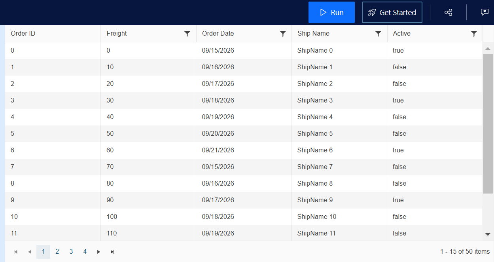

## Description

In many support cases, it is pretty beneficial to isolate the issue in a separate sample to demonstrate the problem at hand. This leads to quick and efficient technical communication within the support thread without going back and forth in circles.

However, creating a new Core or MVC project to demonstrate the issue is not always practical. Is there a way I can expedite the process and make it quicker and more convenient?

## Solution

To tackle this situation, Telerik proudly introduced the unique real-time server compilation tool Telerik REPL:

https://netcorerepl.telerik.com/

Using this tool, you can demonstrate the issue in a live sample with several simple steps. Here is a sample process with a Grid and its Data Binding functionality.

1. Open the tool's web site:
https://netcorerepl.telerik.com/

2. Add a Model class definition:
```C#
@using System.ComponentModel.DataAnnotations;

@functions {
    public class OrderViewModel
    {
        public int OrderID { get; set; }
        public decimal? Freight { get; set; }
        public DateTime? OrderDate { get; set; }
        [Required]
        public string ShipName { get; set; }
        public string ShipCity { get; set; }
        public bool Active { get; set; }
    }
}
```

3. Add the logic from your controller action :
```C#
@{
        // this part simulates Controller Read Action 
        var data = Enumerable.Range(0, 50).Select(i => new OrderViewModel
            {
                OrderID = i,
                Freight = i * 10,
                OrderDate = new DateTime(2026, 9, 15).AddDays(i % 7),
                ShipName = "ShipName " + i,
                ShipCity = "ShipCity " + i,
                Active = i % 3 == 0
            });
}
```

4. Add the Grid definition, but instead of Read, use the BindTo property:
```Razor
@(Html.Kendo().Grid<OrderViewModel>()
    .Name("Grid")
    .Columns(columns =>
    {
            columns.Bound(p => p.OrderID).Filterable(false);
            columns.Bound(p => p.Freight);
            columns.Bound(p => p.OrderDate).Format("{0:MM/dd/yyyy}");
            columns.Bound(p => p.ShipName);
            columns.Bound(p => p.ShipName);
            columns.Bound(p => p.Active);
    })
    .Pageable()
    .Sortable()
    // replace remote binding with local collection just for 
    // demonstrating the issue
    .BindTo(data)
    .Scrollable(scr => scr.Height(430))
    .Filterable()
    .DataSource(dataSource => dataSource
        .Ajax()
        .PageSize(15)
        .ServerOperation(false)
        //.Read(read => read.Action("Orders_Read", "Grid"))
     )
)
```

5. Click Run and ensure the sample is working as expected:



6. Modify the sample to reproduce the issue you are facing.

7. Click the "Share Snippet" button to generate a new URL of the REPL sample and send it in the ongoing thread:


Here is a link with the REPL of the entire sample:
https://netcorerepl.telerik.com/mIPckNvk57VISrJ323

## See Also

* [Telerik UI for {{ site.framework }} Knowledge Base](https://docs.telerik.com/{{ site.platform }}/knowledge-base)
