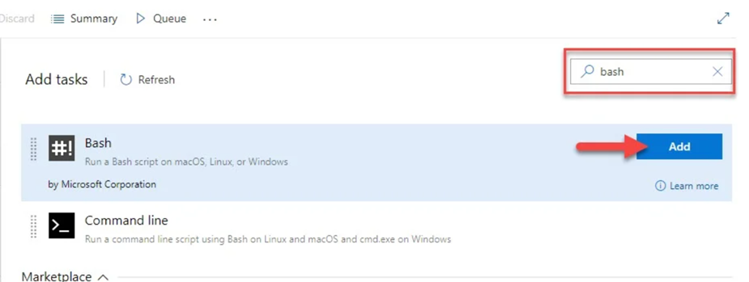
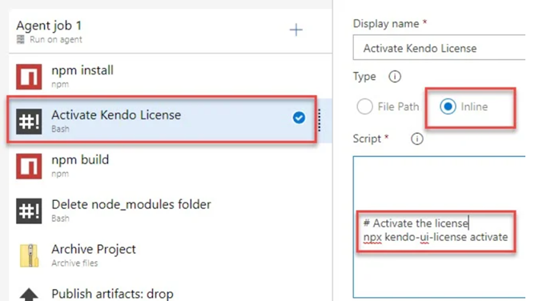

# Adding the License Key to CI Services

This article describes how to set up and activate your Kendo UI for jQuery [license key]() across a few popular CI services by using environment variables or secrets.

The following general requirements apply to all CI/CD environments:

* Regardless of the CI/CD tool you use, the step that installs the project dependencies must be executed before the step that activates the license.
* The license activation step requires the `@progress/kendo-licensing` package to be downloaded and set up in your local environment or CI/CD pipeline.
* To activate the license, you need a securely stored license key, either in your environment variables or in the CI/CD tool's secret management. Hardcoding license keys into the build script is strictly discouraged.
* The CI pipeline configurations are not executable. They merely outline the specific sequence of steps.

# Creating an Environment Variable

Each platform has a different process for setting environment variables. Some popular examples are listed below.

>note Starting with the 2025 Q1 release, the name of the environment variable changes from KENDO_UI_LICENSE to TELERIK_LICENSE and the downloaded file changes from kendo-ui-license.txt to telerik-ui-license.txt. This change is required as all Telerik UI and Kendo UI products now use the same licensing mechanism with a common license key. See the [Handling License Key File Name and Environment Variable Name Changes in the 2025 Q1 Release KB article]() for more details.

## GitHub Actions

1. Create a new [Repository Secret](https://docs.github.com/en/actions/reference/encrypted-secrets#creating-encrypted-secrets-for-a-repository) or an [Organization Secret](https://docs.github.com/en/actions/reference/encrypted-secrets#creating-encrypted-secrets-for-an-organization). Set the name of the secret to `TELERIK_LICENSE` and paste the contents of the [license key file]() as a value.
2. After running `npm install` or `yarn`, add a build step to activate the license:

```yaml
steps:
    # ... Install modules before activating the license.
    - name: Install NPM modules
      run: |
        npm install -g @angular/cli
        npm install
    - name: Activate Kendo UI License
      run: npx kendo-ui-license activate
      # Set a working directory if the application is not in the repository root folder:
      # working-directory: 'ClientApp'
      env:
        TELERIK_LICENSE: ${{ secrets.TELERIK_LICENSE }}
    # ... Run an application build after the activation of the license.
    - name: Build Application
      run: npm run build --configuration production
```

## GitLab CI/CD Pipelines

1. Go to `Settings > CI/CD > Variables` in your GitLab project.
2. Add a new variable named `TELERIK_LICENSE` and paste the content of the [downloaded license key file]() as a value.
3. After running `npm install` or `yarn`, add a build step to activate the license.

```yaml
yaml# .gitlab-ci.yml file
variables:
  NODE_ENV: production
setup_dependencies:
  stage: setup
  script:
    - echo "Installing dependencies..."
    - npm install
  # ...
activate_license:
  stage: activate
  script:
    - echo "Activating Kendo UI license..."
    - npx kendo-ui-license activate
  environment:
    name: production
  variables:
    TELERIK_LICENSE: $TELERIK_LICENSE
  # ...
```

## Azure Pipelines (YAML)

1. Create a new User-defined Variable named `TELERIK_LICENSE`. Paste the contents of the [downloaded license key file]() as a value.
2. After running `npm install` or `yarn`, add a build step to activate the license.

The following example provides the syntax for Windows build agents.

```yaml
pool:
  vmImage: 'windows-latest'
steps:
# ... Install modules before activating the license.
- script: call npm install
  displayName: 'Install NPM modules'
- script: call npx kendo-ui-license activate
  displayName: 'Activate Kendo UI License'
  # Set a working directory if the application is not in the repository root folder:
  # workingDirectory: 'ClientApp'
  env:
    TELERIK_LICENSE: $(TELERIK_LICENSE)
# ... Run an application build after the activation of the license.
- script: call npm run build --configuration production
  displayName: 'Build Application'
```

The following example provides the syntax for Linux build agents.

```yaml
pool:
  vmImage: 'ubuntu-latest'
steps:
# ... Install modules before activating the license.
- script: npm install
  displayName: 'Install NPM modules'
- script: npx kendo-ui-license activate
  displayName: 'Activate Kendo UI License'
  # Set a working directory if the application is not in the repository root folder:
  # workingDirectory: 'ClientApp'
  env:
    TELERIK_LICENSE: $(TELERIK_LICENSE)
# ... Run an application build after the activation of the license.
- script: npm run build --configuration production
  displayName: 'Build Application'
```

## Azure Pipelines (Classic)

1. Create a new [user-defined variable](https://learn.microsoft.com/en-us/azure/devops/pipelines/process/variables?view=azure-devops&tabs=classic%2Cbatch) named `TELERIK_LICENSE`. Paste the contents of the [downloaded license key file]() as a value.
2. Before the NPM build task, add a new Bash task to the Agent job.
3. Change the step to inline and use the following command:

```bash
bash
```

 

```bash
# Activate the license
npx kendo-ui-license activate
```

 

## See Also

* [License Activation Errors and Warnings]()
* [Setting Up Your License Key]()
* [Frequently Asked Questions about Your Kendo UI for jQuery License Key]()